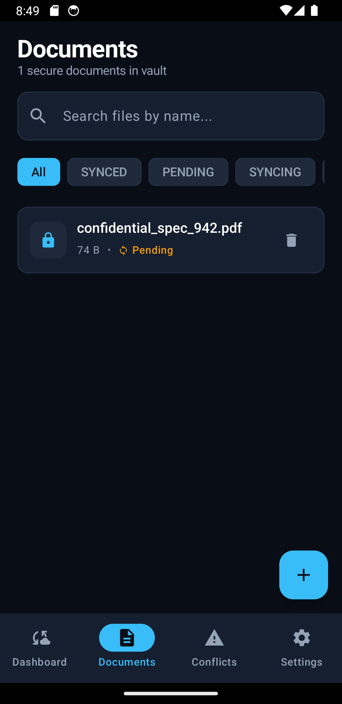
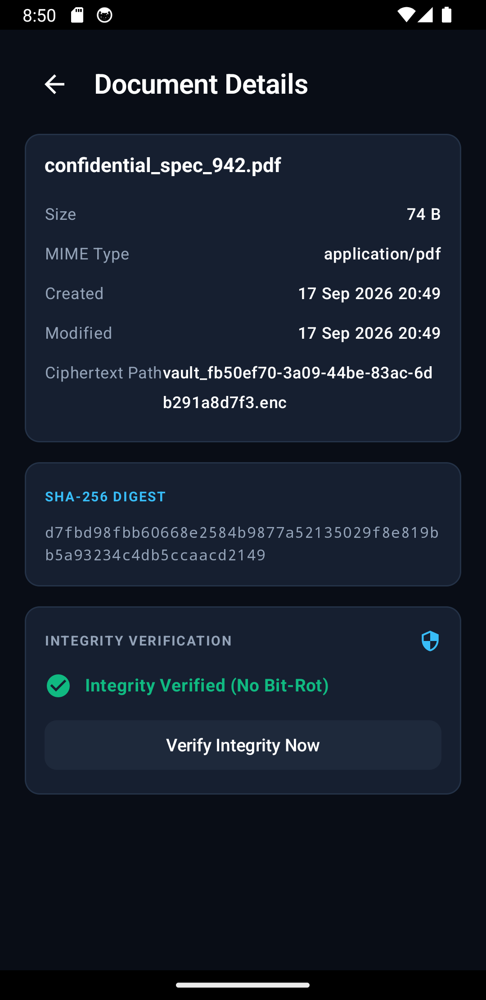
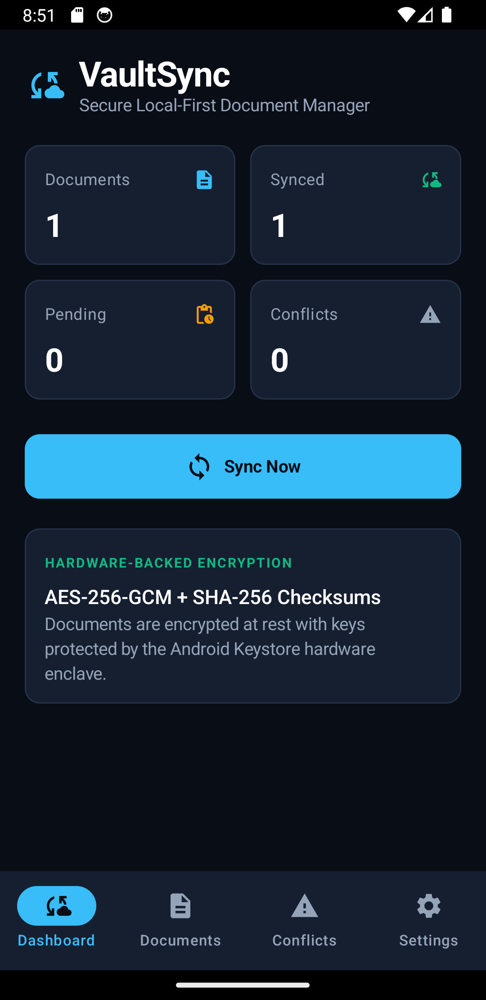
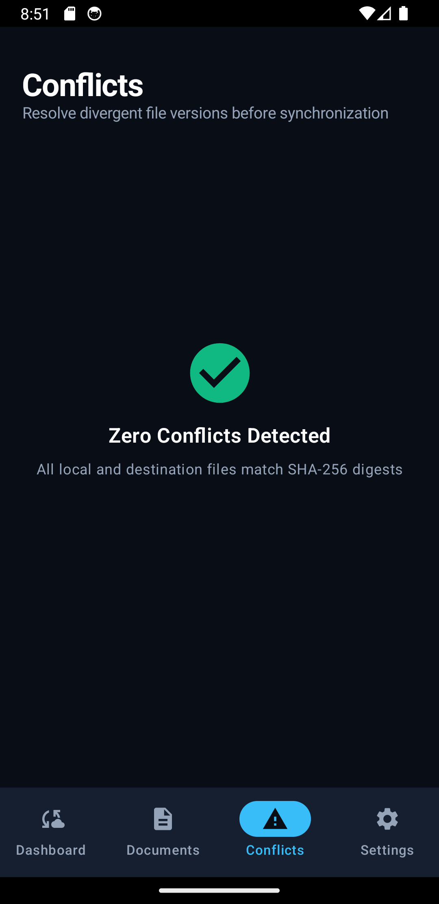
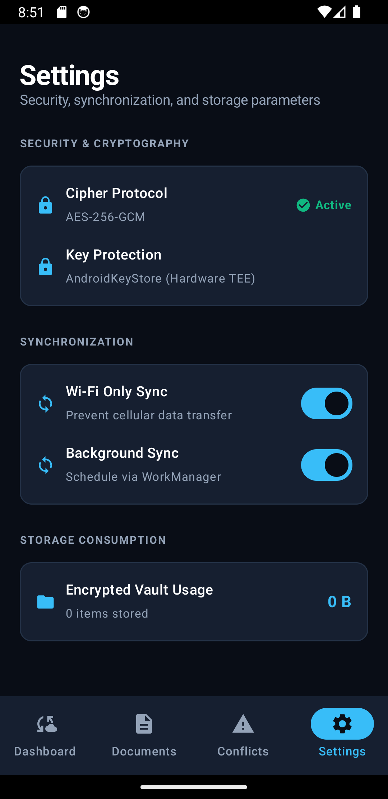

# VaultSync

[](.github/workflows/android.yml)
[](.github/workflows/ios.yml)
[](.github/workflows/release.yml)
[](LICENSE)
[]()

> **A secure, offline-first cross-platform document manager that synchronizes and verifies files while maintaining consistent Clean Architecture and engineering standards across native iOS and Android implementations.**

---

## Application Interface

| Dashboard and Metrics | Encrypted Vault | Document Details and Verification |
| :---: | :---: | :---: |
|  |  |  |

| Synchronized Vault | Conflict Detection | Hardware Security and Settings |
| :---: | :---: | :---: |
|  |  |  |

---

## Architecture Philosophy

```text
One product, two native implementations, one common architecture contract.
```

Instead of relying on a shared runtime or hybrid cross-platform framework (e.g. Flutter or React Native), **VaultSync** demonstrates how to build production-grade, platform-native mobile applications that share an identical architectural blueprint, business domain boundaries, and cryptographic verification protocol.

```text
                         ┌─────────────────────────┐
                         │        VAULTSYNC        │
                         │   Common Architecture   │
                         └────────────┬────────────┘
                                      │
                 ┌────────────────────┴────────────────────┐
                 ▼                                         ▼
        ┌──────────────────┐                      ┌──────────────────┐
        │    iOS Native    │                      │  Android Native  │
        │ Swift + SwiftUI  │                      │ Kotlin + Compose │
        └────────┬─────────┘                      └────────┬─────────┘
                 ▼                                         ▼
        ┌──────────────────┐                      ┌──────────────────┐
        │   Presentation   │                      │   Presentation   │
        │ SwiftUI + MVVM   │                      │ Compose + MVVM   │
        └────────┬─────────┘                      └────────┬─────────┘
                 ▼                                         ▼
        ┌──────────────────┐                      ┌──────────────────┐
        │   Domain Layer   │                      │   Domain Layer   │
        │ 11 Pure UseCases │                      │ 11 Pure UseCases │
        └────────┬─────────┘                      └────────┬─────────┘
                 ▼                                         ▼
        ┌──────────────────┐                      ┌──────────────────┐
        │    Data Layer    │                      │    Data Layer    │
        │ Repository Impl  │                      │ Repository Impl  │
        └────────┬─────────┘                      └────────┬─────────┘
                 │                                         │
        ┌────────┴─────────┐                      ┌────────┴─────────┐
        ▼                  ▼                      ▼                  ▼
  Local Database      File System           Local Database      File System
   (SwiftData)       (FileManager)              (Room)             (SAF)
        │                  │                      │                  │
        ▼                  ▼                      ▼                  ▼
    Keychain + CryptoKit                   Android Keystore + AES-GCM
```

---

## Key Features

1. **Zero-Plaintext Storage (Hardware-Backed Encryption)**
   - All documents in the vault are encrypted at rest using **AES-256-GCM** with authenticated metadata.
   - Encryption keys are stored strictly in hardware-backed storage (**iOS Keychain / Secure Enclave** and **Android Keystore**), never in application databases or plain files.
2. **Deterministic Integrity Verification (SHA-256)**
   - Cryptographic hashing checks before and after synchronization to immediately detect bit-rot, tampering, or interrupted transfer.
3. **Offline-First Sync Engine**
   - Full functionality without active internet connectivity.
   - Deterministic 6-phase sync pipeline: `Scan` -> `Compare` -> `Plan` -> `Execute` -> `Verify` -> `Finalize`.
4. **Three-Way Conflict Resolution**
   - When conflicting file modifications are detected, VaultSync offers explicit resolution strategies: `KEEP_LOCAL`, `KEEP_REMOTE`, and `KEEP_BOTH`.
5. **Resilient Crash Recovery and Bounded Retries**
   - Durable operations queue tracks each sync step (`PENDING`, `RUNNING`, `COMPLETED`, `FAILED`).
   - Interrupted tasks on unexpected crash are safely recovered and reconciled on app relaunch.
   - Exponential backoff retry policy.
6. **Bounded Concurrency and Background Processing**
   - Fixed worker pool (maximum 4 concurrent operations) to prevent I/O saturation and thermal throttling.
   - Background execution via platform-native schedulers: **iOS `BGTaskScheduler`** and **Android `WorkManager`**.

---

## Platform Parity Matrix

| Architectural Capability | iOS Native (`ios/`) | Android Native (`android/`) |
| :--- | :--- | :--- |
| **Language & Tooling** | Swift 5.9+ / Xcode 15+ | Kotlin 1.9+ / Gradle 8.2+ |
| **UI Framework** | SwiftUI (Declarative) | Jetpack Compose (Declarative) |
| **State Management** | `@Observable` / Combine | `StateFlow` / Coroutines |
| **Local Database** | SwiftData / CoreData | Room Persistence Library |
| **Secure Key Storage** | iOS Keychain Services | Android Keystore Provider |
| **Symmetric Encryption** | Apple `CryptoKit` (AES-GCM) | `javax.crypto` (AES/GCM/NoPadding) |
| **Hashing Engine** | `CryptoKit.SHA256` | `java.security.MessageDigest` |
| **File Abstraction** | `FileManagerStorage` | `ScopedFileStorage` |
| **Background Scheduler** | `BGTaskScheduler` | AndroidX `WorkManager` |
| **Automated Testing** | `XCTest` | JUnit 4 + MockK |
| **Continuous Integration** | GitHub Actions (`macos-14`) | GitHub Actions (`ubuntu-latest`) |

---

## Clean Architecture Layers

Dependency Rule: **Outer layers depend on inner layers; the Domain layer depends on nothing.**

```text
Presentation Layer (UI, ViewModels, Theme)
       │
       ▼
Domain Layer (Pure Models, Repository Interfaces, Use Cases)
       ▲
       │
Data Layer (Room/SwiftData, Keystore/Keychain, File Storage, Sync Engine)
```

### Domain Use Cases

1. `GetDocumentsUseCase`: Queries documents with filtering and search.
2. `ImportDocumentUseCase`: Reads, encrypts, hashes, and persists incoming files.
3. `DeleteDocumentUseCase`: Securely removes ciphertext and database records.
4. `CalculateFileHashUseCase`: Calculates SHA-256 for data streams.
5. `VerifyIntegrityUseCase`: Compares stored checksums with recomputed hashes.
6. `DetectDuplicatesUseCase`: Fast duplicate identification via hash index.
7. `StartSyncUseCase`: Orchestrates the 6-phase sync pipeline.
8. `PauseSyncUseCase`: Suspends pending sync queue execution.
9. `ResumeSyncUseCase`: Resumes paused queue execution.
10. `ResolveConflictUseCase`: Applies `KEEP_LOCAL`, `KEEP_REMOTE`, or `KEEP_BOTH`.
11. `GetSyncStatusUseCase`: Exposes reactive sync progress and queue metrics.

---

## Repository Structure

```text
VaultSync/
├── docs/
│   ├── screenshots/                     
│   │   ├── dashboard.png
│   │   ├── documents.png
│   │   ├── integrity_verification.png
│   │   ├── synced.png
│   │   ├── conflicts.png
│   │   └── settings.png
│   ├── CROSS_PLATFORM_ARCHITECTURE.md   
│   ├── ARCHITECTURE.md                  
│   ├── SECURITY.md                      
│   ├── SYNC_PROTOCOL.md                 
│   ├── TESTING.md                       
│   └── ADR/                             
│       ├── 001-clean-architecture.md
│       ├── 002-native-platforms.md
│       ├── 003-local-first.md
│       ├── 004-encryption-strategy.md
│       ├── 005-sync-conflict-resolution.md
│       ├── 006-background-processing.md
│       └── 007-testing-strategy.md
├── android/
│   ├── build.gradle.kts
│   ├── app/
│   │   ├── build.gradle.kts
│   │   └── src/
│   │       ├── main/java/com/vaultsync/
│   │       │   ├── domain/              
│   │       │   ├── data/                
│   │       │   ├── sync/                
│   │       │   └── ui/                  
│   │       └── test/                    
├── ios/
│   ├── Package.swift
│   └── VaultSync/
│       ├── Sources/VaultSync/
│       │   ├── Domain/                  
│       │   ├── Data/                    
│       │   ├── Presentation/            
│       │   └── Background/              
│       └── Tests/VaultSyncTests/        
└── .github/
    └── workflows/
        ├── android.yml                  
        ├── ios.yml                      
        └── release.yml                  
```

---

## Building and Running

### Android

```bash
cd android
./gradlew testDebugUnitTest
./gradlew assembleDebug
./gradlew assembleRelease
```

### iOS

```bash
cd ios
swift test
```

---

## CI/CD and Release Automation

VaultSync includes GitHub Actions pipelines:

1. **Android CI** ([.github/workflows/android.yml](.github/workflows/android.yml)): Runs unit tests (`testDebugUnitTest`), runs Android Lint, and uploads the debug APK artifact on every pull request to `main`.
2. **iOS CI** ([.github/workflows/ios.yml](.github/workflows/ios.yml)): Runs unit tests on macOS-14 with Swift Concurrency and code coverage on pull requests.
3. **Automated Release Pipeline** ([.github/workflows/release.yml](.github/workflows/release.yml)): Triggered on Git tag pushes matching `v*` or manual workflow dispatch. Builds the release Android APK (`VaultSync-Android.apk`), archives the iOS distribution package (`VaultSync-iOS-Package.zip`), calculates cryptographic SHA-256 digests (`checksums.txt`), and publishes all release assets to official GitHub Releases.

---

## Technical Interview Defense Highlights

1. **Why two native implementations instead of cross-platform (Flutter or React Native)?**
   * *Rationale:* Storage and security operations on mobile are deeply coupled to hardware accelerators and platform sandboxes (iOS Secure Enclave vs Android Keystore). Native implementations provide optimal I/O throughput, zero cross-bridge serialization overhead, and direct access to modern platform capabilities like SwiftData and Jetpack Compose while demonstrating cross-platform system design skills through shared contracts.
2. **How does VaultSync guarantee zero plaintext data leakage?**
   * *Rationale:* Inbound files are immediately encrypted in memory with AES-GCM before writing to the app's private sandbox directory. The random 256-bit symmetric keys are held exclusively in the platform's hardware key store. The local SQLite/Room/SwiftData database contains only metadata, initialization vectors (IV/nonce), authentication tags, and SHA-256 hashes.
3. **How does the Sync Engine handle sudden app termination or power loss?**
   * *Rationale:* The engine uses a durable, write-ahead operation journal. Operations start in a `PENDING` state and transition to `RUNNING` within atomic database transactions. On cold boot, `CrashRecoveryHandler` scans for unfinished `RUNNING` tasks, validates the target file state with SHA-256, and either safely rolls back or resumes execution without data corruption.

---

## License

VaultSync is open source under the [MIT License](LICENSE).
